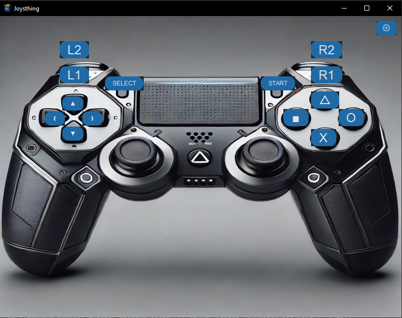

# JOYSTHING
It is a program that simulates that you are using your keyboard, but in reality you are using your joystick.

*`For my future self, the name is due to the mispronunciation of this word in Spanish "josting".`*

## Progress list
- [X] Add buttons that bind to keys.
- [X] Configurable keys.
- [ ] Save Configuration.
- [X] Select device.
- [ ] More than one device.
- [ ] Link and configure analogues.
- [ ] Hold down the button (or key).
## How to use it

__Instructions to assign a key to a button:__

+ Select your device in settings.

+ Use your mouse to select the button you want to assign a key to.

+ After selecting the button, press the key you want to link.

> [!WARNING]  
> The application is under development so this may be wrong.

## additional information
The joystick image was created with AI.  
Logo created by Sofia G.